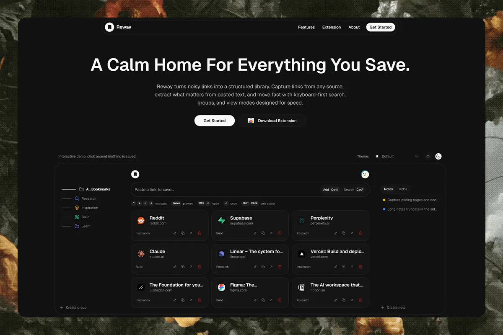

# Reway

<div align="center">
  
</div>

> **Status: active development — July 2026**

Reway is a personal bookmark operating system for people who save heavily and need to find things later. It pairs a synced web dashboard with a Chrome extension, making it easy to capture a page, a batch of links, or an entire tab session without turning saving into an organisational chore.

## Project at a glance

|                   |                                                               |
| ----------------- | ------------------------------------------------------------- |
| **Product**       | Cross-device bookmark library and browser capture tool        |
| **Audience**      | Researchers, designers, developers, and heavy-tab users       |
| **Engagement**    | Product strategy, UX/UI, and full-stack development           |
| **Timeline**      | January 2026 — active development                             |
| **Current focus** | Fast capture, reliable retrieval, and extension accessibility |

## Services

- Product strategy and feature definition
- Information architecture and interaction design
- Visual design and design-system implementation
- Next.js application engineering
- Supabase data, authentication, and API integration
- Chrome extension design and development
- Performance, accessibility, and interaction refinement

## Starting point

The starting point was a familiar research problem: people save useful material constantly, but browser bookmarks are usually treated as a final resting place rather than a working library. The result is a growing collection of links that is hard to trust, hard to scan, and even harder to revisit.

The project began by reframing the bookmark as an active piece of a person's workflow. A saved page should be quick to capture, easy to recognise later, and available wherever the person returns to their research.

## The problem

The challenge was not simply to build another bookmarks interface. Reway needed to resolve several competing needs at once:

- Capture cannot interrupt browsing or research.
- Organisation needs enough flexibility for real libraries without becoming maintenance work.
- Retrieval has to work when a person remembers only part of a title, image, topic, or previous visit.
- The web library and browser capture tool must feel like one private, reliable product.

## The solution

Reway was designed around a simpler promise: capture first, organise immediately, and enrich in the background. The experience needs to feel calm and instant at the moment of saving, while still building a visual, searchable library that works across devices.

## What we delivered

- A responsive marketing and authentication experience.
- A private dashboard for browsing, searching, grouping, reordering, and managing bookmarks.
- Multiple ways to scan a library: list, cards, icons, and a folder-board view.
- Notes and todos alongside saved references, so active work can stay close to source material.
- A keyboard-first command bar and lightweight controls for frequent actions.
- A Chrome extension for saving the current page, selected link batches, and whole tab sessions.
- Optional X bookmark capture and a quick-access browser surface for opening saved material.
- Background metadata enrichment for titles, descriptions, favicons, and images, without delaying a save.
- Private, user-scoped data handling with duplicate checks and live dashboard updates.

## Outcome

The result is a working, end-to-end bookmark product rather than a dashboard concept: people can capture references from the browser, return to a synced private library, organise it in ways that fit their workflow, and retrieve saved material with less friction.

The delivered foundation also creates room for a more mature product: capture and enrichment are deliberately separate, the application and extension have clear responsibilities, and the current development cycle is refining speed, reliability, and accessibility. As Reway remains in active development, this case study reports delivered product capability—not launch, revenue, or adoption metrics.

## Product decisions

### Make capture feel immediate

Saving creates the bookmark first. URL cleanup, duplicate checks, and metadata enrichment happen as follow-up work, so an unreliable page or slow metadata response does not interrupt the core action.

### Design for retrieval, not just storage

Reway combines search, visual metadata, flexible views, groups, and visit-aware ordering. The aim is not simply to collect links, but to make previously saved material recognisable and useful again.

### Meet people where research happens

The dashboard is the home for the library; the browser extension is the capture surface. That split keeps the everyday save flow close to the page or session a person is already using.

## Architecture, in plain language

```text
Web dashboard + Chrome extension
              ↓
   authenticated capture and library APIs
              ↓
       Supabase database and auth
              ↓
 background enrichment + live updates
```

The web application is built with Next.js, React, TypeScript, and Tailwind CSS. Supabase provides authentication and the Postgres-backed data layer. The extension follows Chrome Manifest V3 and keeps browser-specific work separate from the dashboard. This structure supports a fast visible save while the richer details arrive asynchronously.

## Technology stack

| Area                  | Technology                                      |
| --------------------- | ----------------------------------------------- |
| **Application**       | Next.js 16, React 19, TypeScript                |
| **UI**                | Tailwind CSS 4, shadcn/ui, Hugeicons, Motion    |
| **Data and auth**     | Supabase, PostgreSQL, Supabase Auth             |
| **Browser extension** | Chrome Manifest V3, vanilla JavaScript, esbuild |
| **Interaction**       | dnd kit, React Hook Form, Zod                   |
| **Tooling**           | pnpm, ESLint, oxfmt                             |

## Timeline

| Period            | Focus                                                                                                                           |
| ----------------- | ------------------------------------------------------------------------------------------------------------------------------- |
| **January 2026**  | Product foundation: landing experience, authentication, dashboard direction, and visual system.                                 |
| **Spring 2026**   | Expanded capture, organisation, search, and browser-extension workflows.                                                        |
| **May–June 2026** | Performance and reliability work: bookmark ranking, database search indexes, ordering improvements, and quick-access hardening. |
| **July 2026**     | Accessibility refinement for the browser quick-access experience, including keyboard and focus behaviour.                       |

## Current product status

Reway is an actively developed product. The web dashboard, authenticated library, Chrome extension capture flows, asynchronous enrichment, and quick-access browser experience are implemented. Current work is focused on polishing reliability, performance, and accessibility rather than presenting the product as finished or commercially launched.

## Running the project locally

### Prerequisites

- Node.js 20+
- pnpm
- A Supabase project

### Setup

1. Clone the repository and install dependencies:

   ```bash
   git clone https://github.com/mohamedgshoaib/reway.git
   cd reway
   pnpm install
   ```

2. Copy `.env.example` to `.env.local` and add your Supabase project URL, publishable key, and service-role key.
3. Apply the tracked migrations in `supabase/migrations/` through your Supabase CLI or normal database workflow.
4. Start the web app:

   ```bash
   pnpm dev
   ```

5. For the browser extension, build its quick-access bundle and load the `extension/` folder as an unpacked extension in Chrome:

   ```bash
   pnpm build:ext
   ```

See [extension/README.md](extension/README.md) for the manual Chrome installation steps.

## Project structure

- `app/` — routes, server actions, and API endpoints.
- `components/` — landing, dashboard, authentication, and shared UI.
- `extension/` — Chrome extension source and assets.
- `lib/` — data access, capture, ranking, metadata, and shared utilities.
- `hooks/` — dashboard behaviour and UI state.
- `supabase/migrations/` — versioned database changes.

## Credits

Designed and developed by [Devloop](https://www.devloop.software/).
